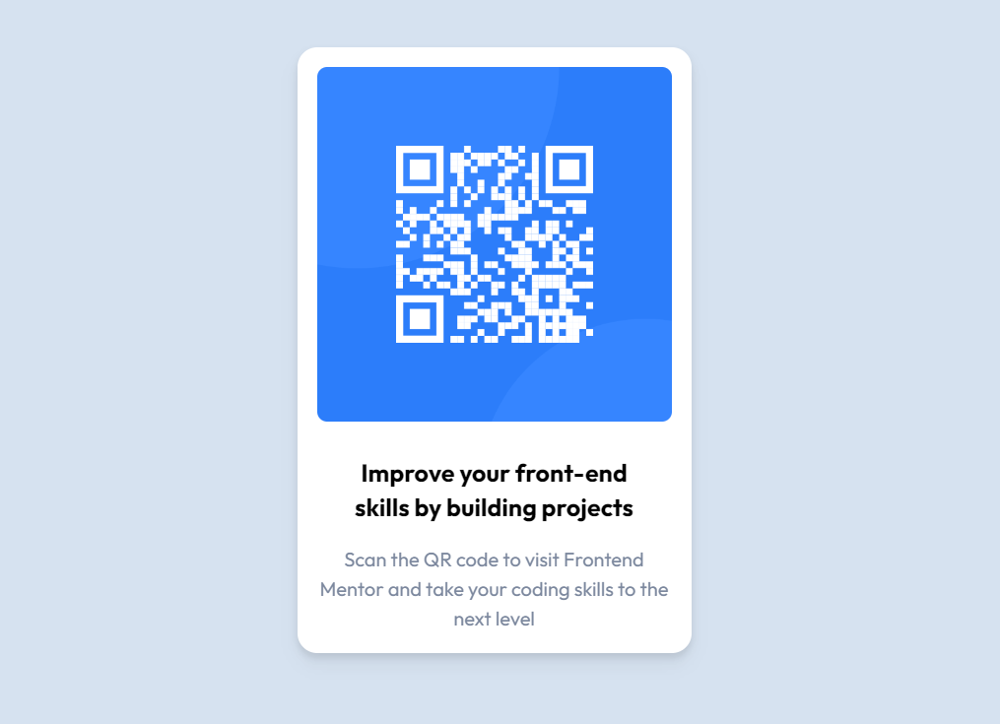

# Frontend Mentor - QR code component solution

Welcome! This is my solution to the [QR code component challenge on Frontend Mentor](https://www.frontendmentor.io/challenges/qr-code-component-iux_sIO_H). 

## Table of contents

- [Overview](#overview)
  - [Screenshot](#screenshot)
  - [Links](#links)
- [My process](#my-process)
  - [Built with](#built-with)
  - [What I learned](#what-i-learned)
  - [Continued development](#continued-development)
  - [Resources used](#resources-used)
- [Author](#author)

## Overview

This is the first suggested project created for the Frontend Mentor challenges. My goal for these challenges is to practice and improve my frontend skills using personal favored tools for projects. At present, the tools I am using to build projects are ReactJS and TailwindCSS. Since completing bootcamp, I found Tailwind to be my personal favorite CSS library with great freedom of design compared to tools such as Bootstrap. As I complete Frontend challenges, I intend to reinforce fundamentals as well as get some good practice in for personal projects.

### Screenshot

### Links

- Solution URL: [https://github.com/jimmehhuang/QR-component](https://github.com/jimmehhuang/QR-component)
- Live Site URL: [Add live site URL here](https://your-live-site-url.com)

## My process

### Built with

- Semantic HTML5 markup
- [Tailwind CSS](http://tailwindcss.com/) - Styles
- Flexbox
- Mobile-first workflow
- [React](https://reactjs.org/) - JS library

### What I learned

Stepping back to fundamentals while using a tool that emphasizes mastery of said fundamentals helped me reinforce some nearly-lost knowledge. Naturally I do not intend to construct static HTML pages for future projects, but remembering how exactly they function was good practice.

Additionally, I mistakenly was attempting to run the static HTML page instead of going the route of npm run dev like I had noted in the package.json. The frustration of wondering why my styling changes weren't updating costed me some hours of productivity.

### Continued development

As I continue to build more projects and practice with react and Tailwind, I intend to master responsive design, especially with mobile-first workflows. Flexbox and grid concepts are also something I need much more practice with as well.

### Resources used

- [Tailwind Docs](https://tailwindcss.com/docs/installation) - The main resource I used for styling was the documentation itself. I referred to this constantly for practice and to become accustomed to Tailwind stylization.

## Author

- Frontend Mentor - [@jimmehhuang](https://www.frontendmentor.io/profile/jimmehhuang)
- My portfolio website! Which, as of this mini-project submission, is still under construction - [Jimmy Huang](https://jimmehhuang.com)
